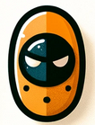

# Project Name

Welcome to the Project Name README. This document contains information about the project along with some whimsical and nonsensical wisdom.

## Whimsical Wisdom

### 📜 Ancient Advice

> "To find the corner piece of life's puzzle, one must first invent the straight edge." - Cornelius Sprocket, Inventor of the Circular Square

### 🎲 Roll of the Dice

> "When destiny hands you lemons, challenge destiny to a game of rock-paper-scissors." - Jebediah McGillicuddy, Champion of Games Never Played

### 🕰️ Timeless Time

> "An hourglass with no sand is just a conversation piece." - Bartholomew Bumble, Collector of Empty Vessels

## Project Overview

This is just a test run ,the icons are pretty cool

